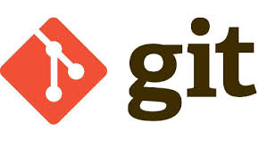
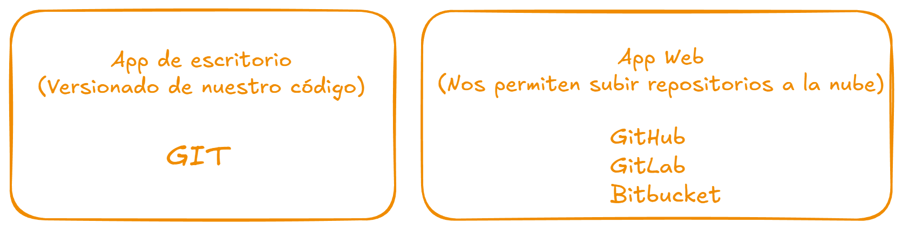
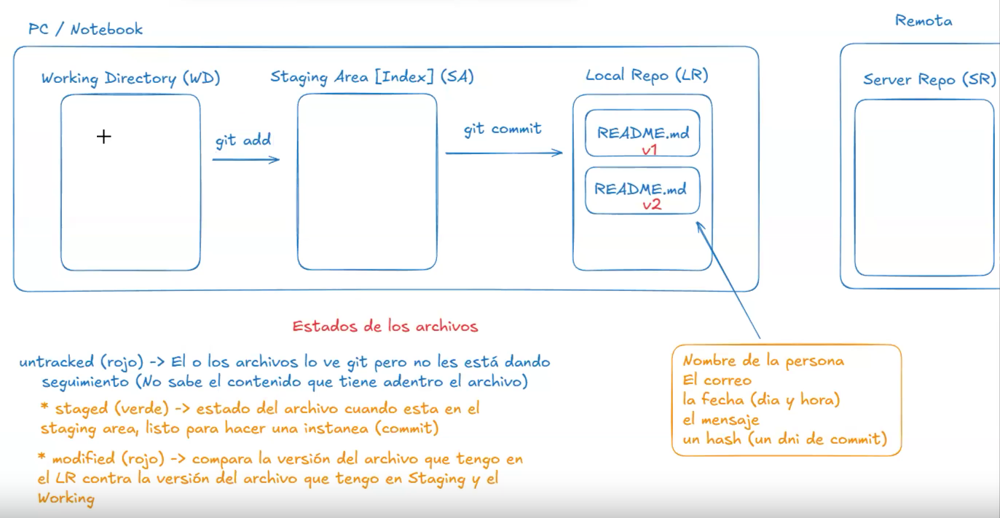

# Clase 01 - Git desarrollo colaborativo

## Markdown (md)
Me permite tomar apuntes y generar documentaciones. Además de introducir un repositorio de GIT.

# h1
## h2
### h3
#### h4
##### h5
###### h6

### Listas ordenadas y desordenadas

* Punto 
* Punto
* Punto

1. Número 1
2. Número 2
3. Número 3

### Imagenes en Markdown



### Links 

<https://git-scm.com/>

## Git

### Instalaciones necesarias

* <https://git-scm.com/>
* <https://code.visualstudio.com/>

### Registrarse

* <https://github.com/>

## Git vs GitHub



## Verificamos que tenemos instalado git

```sh
git --version
```

## Configuración básica de GIT (Se hace una sola vez)

```sh
git config --global user.name "Maximiliano Principe"
git config --global user.email mlapeducacioit@gmail.com
```

## Listar datos cargados 

```sh
git config --list | grep user
user.email=mlapeducacioit@gmail.com
user.name=Maximiliano Principe
```

# Empezar a trabajar con el versionado de un proyecto

```sh
git init # El comando se ejecuta dentro de la carpeta del proyecto
## --
Initialized empty Git repository in D:/_courses/82060-git-desarrollo-colaborativo/.git/
``` 

## Cambiar nombre de la rama

```sh
git branch -m master main
```

## Para que los cambios sean de forma global

```sh
git config --global init.defaultBranch main
```

## ¿Cómo saber en que área y en que estado están los archivos?

```sh
git status # Forma larga con info.
```

## Áreas de GIT



## Estado de los archivos

* untracked (rojo) -> El o los archivos lo ve git pero no les está dando seguimiento (No sabe el contenido que tiene adentro el archivo)

* staged (verde) -> estado del archivo cuando esta en el staging area, listo para hacer una instanea (commit)

* modified (rojo) -> compara la versión del archivo que tengo en el LR contra la versión del archivo que tengo en Staging y el Working

## Marcar archivos (marcarlos en el staging area) para que se guarden en el próximo commit

```sh
git add <nombre-archivo>
git add <nombre-archivo1> <nombre-archivo2> <nombre-archivo3>
git add . # marco todos los archivos para que sean parte del próximo commit
``` 

## Creamos un commit con los archivos marcados (en el staging area)

```sh
git commit -m "<Descripción del contenido de los archivos>"
git commit -m "Empezando con git, explicando markdown y las bases"
``` 

## Listar commits (mostrar timeline de commits)

```sh
git log # Forma larga
git log --oneline # Forma corta
```
