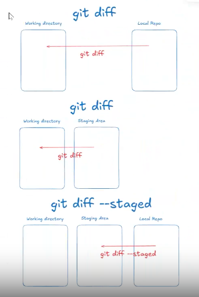
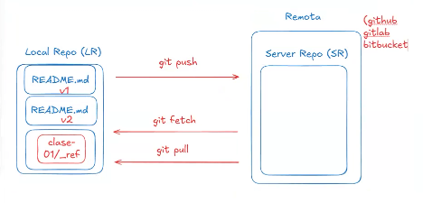

# Clase 02 - Git desarrollo colaborativo

## Repaso comandos vistos.

> Muestro el estado y área en la que están los archivos

```sh
git status
```

> Marcamos archivos que están en el working directory para posteriormente hacer un commit

```sh
git add class-01/_ref/* # Marco todos los archivos que están dentro de la carpeta _ref
git add class-01/* # marca todos los archivos que estan dentro de la carpeta class-01
git add . # Este comando me sirve para marcar todos los archivos para luego hacer un commit
```

> Hacemos un commit (Snapshot, instantanea)

```sh
git commit -m "mensaje descriptivo"  # 80 caracteres maximo
```

> Listo timeline de commits (listado de commits)

```sh
git log --oneline
```
# .gitignore
Es un archivo que me permite indicarle a GIT que no quiero que la carpeta o el archivo sea controlado por GIT
Dentro del archivo hay que inficar que carpetas o archivs queremos que GIT ignore

# .gitkeep
Es un archivo que me permite darle seguimiento a una carpeta que quiero sea parate del repo pero que esté vacía. (para que sea utilizada luego).
Se hace esto porque GIT no versiona carpetas vacías. Sólo versiona carpetas que tengan archivos dentro.
Este archivo no lleva ningún tipo de contenido ni código y debe ser generado dentro de la carpeta vacía.

# Ver la diferencia entre WD y SA o LR 
```sh
git diff #compara working con staging area, y en caso de que no haya nada en el staging area compara el working con el local repo
git diff --staged #muestra la diferencia entre el stagging area y el local repo
```


# Ver más información de un commit
```sh
git show <nro de hash>
git show b20a1a
```

## Recuperar archivos desde el LOCAL REPO

```sh
git restore <nombre-archivo1> <nombre-archivo2>
git restore clase-02/README.md
git restore .  #recupera todos los archivos a la version actual del LR
```

## Comandos para hacer add y commits en un solo paso

**IMPORTANTE**: Solo funciona con archivos que ya están siendo seguidos por GIT. Si tengo archivos untracked esos archivos cuando haga el comando no se van a agregar al Staging Area (no se van a commitear)

```sh
git commit -am "mensaje descriptivo" # -a (add) -m (commit)
```

## Enmendar un commit. (Puedo agregar archivos o modificaciones a un archivo)
Evita por ejemplo que tenga que hacer un commit de un archivo que me olvide guardar.
Además se puede utilizar  para corregir el mensaje del último commit.

```sh
git commit --amend -m "<mensaje descriptivo de commit>"
git commit --amend -m "Como enmendar un commit agregando archivos o cambiando el titulo del commit"
git commit --amend -am "<....>" #marcar y commitear(add + mensaje)
```

En el caso de que quiera agregar algo pero no quiera cambiar el mensaje

```sh
git commit -a --amend --no-edit
```


## Trabajar con el remoto  --  Interactuar (sincronizar) el area local con el remotogit add


#### Existen tres dinamicas: 
* git push
* git fetch
* git pull 



Para agregar un repositorio remoto en mi local
```sh
git remote add <alias> <url-al-remoto>
git remote add origin https://github.com/viviana-lopez/cursoGit2026.git
```
## Puedo sincronizar los cambios (subir el repo local al remoto)
> La primera vez
```sh
git push -u origin main # -u <--- indica a git que trabaje en forma sincronizada con la rama remota (main con origin/main)>
```

> Las siguientes veces, no es necesario indicarle que ramas deben estar sincronizadas (si se trabaja entre mains) y solo se indica que haga el push
```sh
git push
```

## Para verificar si el repositorio está asociado al remoto y las ramas

>Verificar si el repositorio está sociado al remoto
```sh
git remote # si devuelve "origin" significa que están asociados
git remote -v # va a devolver con más detalle si está sociado el local con el remoto
```

> Ver las ramas
```sh
git branch # muestra solamente las ramas locales. "main"
git branch -r # muestra solamente las ramas remotas. "origin/main"
git branch -a # muestra todas las ramas (locales y remotas)
git branch -av # muestra todas las ramas con más detalles, indica que tan desfazadas están
```

> Tres formas de ver las diferencias entre las ramas
```sh
git status
git branch -av
git log --oneline -"<nro cantidad de commits>"
git log --oneline --all
```

> Sincronización entre el local y el remoto.

Para poder verificar si hay desfazaje en el caso de estar trabajando desde el remoto o en equipo (varios suben actualizaciones en el remoto) se debe traer la información del remoto para poder hacer la comparación, pues git no puede comparar información desconocida. Para esto se debe realizar la sinconización.
```sh
git push -u origin main # -u <--- indica a git que trabaje en forma sincronizada con la rama remota (main con origin/main)>. Se hace sólo la 1ra vez que hacemos el push
git push # actualiza llevando la información local hacia el remoto (LOCAL ==> REMOTO)
git fetch # actualiza trayendo unicamente la metadata del remoto hacia el local (REMOTO ==> LOCAL). Eto permite visualizar las ramas actualizadas sin actualizar el Local Repository y poder saber si queremos o no traer el archivo actualizado
git pull # actualiza el Local Repository trayendo la metadata y el archivo actualizado
```


